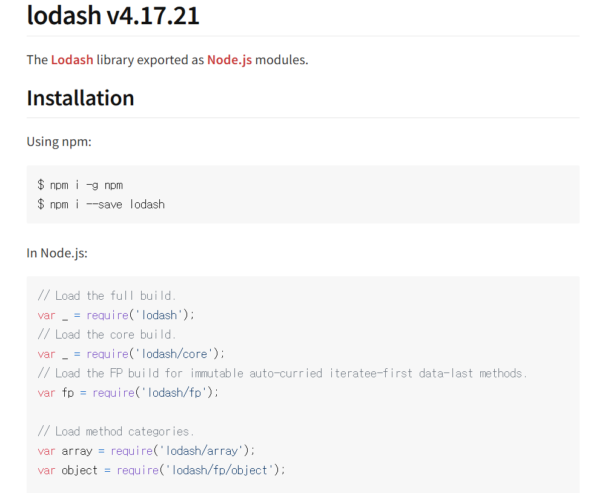

이번 에피소드에서는 Node.js에 대해 정리해 본다.

___

**차례**

- [Node.js란](#nodejs란)
- [Node.js 패키지](#nodejs-패키지)
  - [만들기](#만들기)
  - [패키지 스크립트 사용](#패키지-스크립트-사용)
- [Node.js 모듈 시스템](#nodejs-모듈-시스템)
  - [ES 모듈 시스템](#es-모듈-시스템)
    - [개별 내보내기](#개별-내보내기)
    - [개별 불러오기](#개별-불러오기)
    - [전부 불러오기](#전부-불러오기)
    - [기본값으로 내보내기](#기본값으로-내보내기)
- [라이브러리 사용하기](#라이브러리-사용하기)
  - [설치](#설치)
  - [node\_modules](#node_modules)
  - [dependencies](#dependencies)
  - [package-lock.json](#package-lockjson)
  - [라이브러리 다시 설치](#라이브러리-다시-설치)
- [결론](#결론)

___

## Node.js란

자바스크립트는 웹 브라우저에 내장된 자바스크립트 엔진으로 실행되는데, 이 웹 브라우저를 '자바스크립트 런타임'이라고도 표현한다.

Node.js 등장 이전에는 웹 브라우저가 유일한 자바스크립트(JS) 런타임이었다. 즉, 웹 브라우저가 아니면 JS를 사용할 수 없었다. 그러나 Node.js가 등장하면서 어떤 환경에서도 JS를 실행할 수 있게 된 것이다.

Node.js에는 React를 효율적으로 다루는 여러 도구들이 내장되어 있고, 궁극적으로 Node.js가 리액트로 만든 JS 앱을 구동하므로, 리액트를 잘 다루려면 Node.js 학습이 선행되어야 한다.

## Node.js 패키지

Node.js를 설치하는 과정과 환경 설정하는 과정은 생략한다.

복잡한 프로그램을 만들기 위해서는 여러 개의 자바스크립트 파일이 필요하다. 그러지 않으면 파일이 너무 길어지기 때문이다. 일반적으로 기능별로 파일을 나누어 작성하는 편이다.

하나의 프로젝트에서 여러 자바스크립트 파일을 Node.js로 실행할 때는 패키지 형태로 구성한다. Node.js에서 여러 개의 JS 파일을 실행하고 관리하는 일종의 관리 단위가 패키지다.

### 만들기

패키지를 생성하려면 npm을 이용한다.

```batch
npm init
```

패키지 이름을 입력하는 프롬프트가 나오면 패키지 이름을 입력한다. 

그 이후에도 무언가를 계속 물어보는데, 일단은 엔터 키만 계속 누르면 된다.

그러면 package.json 파일이 생성된다.

```json
{
  "name": "chapter3",
  "version": "1.0.0",
  "main": "index.js",
  "scripts": {
    "test": "echo \"Error: no test specified\" && exit 1"
  },
  "author": "",
  "license": "ISC",
  "description": ""
}
```

### 패키지 스크립트 사용

package.json을 보면 scripts 항목이 있다. 이 항목에서는 복잡한 명령어를 간단한 명령어로 변경하는 매크로 기능을 지원한다.

루트 폴더에 다음 index.js 파일을 생성하자.

```js
console.log("index run")
```

그리고 package.json은 다음과 같이 수정한다.

```json
{
  "name": "chapter3",
  "version": "1.0.0",
  "main": "index.js",
  "scripts": {
    "test": "echo \"Error: no test specified\" && exit 1",
    "start": "node index.js"
  },
  "author": "",
  "license": "ISC",
  "description": ""
}
```

index.js를 실행하려면 원래는 node ./index.js라고 입력해야 하지만, 스크립트를 설정했으므로 이제는

```batch
npm run start
```

라고 해도 된다.

## Node.js 모듈 시스템

복잡한 앱을 만드려면 파일 하나로는 부족하다고 했다. 그렇다면 여러 파일로 이루어진 패키지에서는 각각의 파일이 다른 파일을 불러와 사용할 수 있어야 한다. 이를 가능하게 만드는 것이 Node.js의 모듈 시스템이다.

### ES 모듈 시스템

리액트는 ESM (ECMAScript 모듈 시스템)을 채택하고 있다. 하지만 Node.js는 기본적으로 CJS 모듈 시스템을 사용한다. 따라서 ESM을 사용하려면, 설정을 변경해 주어야 한다.

package.json에서 `"type": "module"`을 추가하면 된다.

```json
{
  "name": "chapter3",
  "version": "1.0.0",
  "main": "index.js",
  "scripts": {
    "test": "echo \"Error: no test specified\" && exit 1",
    "start": "node index.js"
  },
  "author": "",
  "license": "ISC",
  "description": "",
  "type": "module"
}
```

이렇게 하면 이 패키지는 모듈 시스템으로 ESM을 사용한다.

#### 개별 내보내기

자바스크립트에서 모듈은 단지 하나의 파일일 뿐이다. 따라서, JS 파일은 다른 파일에서 불러와 사용할 수 있다.

루트 폴더에 circle.js를 다음과 같이 생성해 보자.

```js
const PI = 3.141592

function getArea(radius){
  return PI * radius * radius;
}

function getCircumference(radius){
  return 2 * PI * radius;
}
```

여기서 생성한 PI와 두 함수를 내보내고 싶다. ESM에서는 선언 앞에 export 키워드를 붙이면 된다.

```js
export const PI = 3.141592

export function getArea(radius){
  return PI * radius * radius;
}

export function getCircumference(radius){
  return 2 * PI * radius;
}
```

또는 한 번에 여러 값을 내보내기 위해 다음과 같이 사용한다.

```js
const PI = 3.141592

function getArea(radius){
  return PI * radius * radius;
}

function getCircumference(radius){
  return 2 * PI * radius;
}

export { PI, getArea, getCircumference };
```

#### 개별 불러오기

Python처럼 ESM도 import로 값을 불러온다.

index.js의 내용을 지우고 다음과 같이 작성하자.

```js
import {PI, getArea, getCircumference} from "./circle.js";

console.log(PI, getArea(1), getCircumference(1));

// OUTPUT
// 3.141592 3.141592 6.283184
```

#### 전부 불러오기

불러올 값이 많다면, `import * as A from B`와 같이 한 번에 불러올 수 있다.

그렇다면 index.js를 다음과 같이 수정할 수 있다.

```js
import * as circle from "./circle.js"

console.log(PI, getArea(1), getCircumference(1));
```

#### 기본값으로 내보내기

ESM에서는 export 키워드 다음에 default를 붙여 모듈의 기본값으로 내보낼 수 있다.

```js
export default 10; // 모듈의 기본값
```

이렇게 기본값으로 내보내면 다른 모듈이 이 값을 불러올 때 다른 이름을 붙여도 된다.

무슨 소린지 알아보기 위해 circle.js를 다음과 같이 수정하자.

```js
const PI = 3.141592

function getArea(radius){
  return PI * radius * radius;
}

function getCircumference(radius){
  return 2 * PI * radius;
}

export default {PI, getArea, getCircumference};
```

이를 index.js에서 불러올 때...

```js
import circle from "./circle.js";

console.log(circle.PI, circle.getArea(1), circle.getCircumference(1));
```

이렇게 임의로 이름을 circle로 정해서 불러올 수 있다는 뜻이다.

python의 as와 비슷하다고 볼 수도 있겠다.

default를 쓰지 않으면, 이렇게 임의로 이름을 정해 불러올 수 없음에 주의하자.

## 라이브러리 사용하기

Node.js 패키지에서는 외부 패키지를 설치해 사용할 수 있다. 다른 말로 라이브러리라고 한다. 라이브러리는 프로그램을 개발할 때 공통 기능을 모아 모듈화한 것이다. 완전한 프로그램은 아니고 특정 기능만을 수행한다.

예를 들면 'Lodash'라는 라이브러리는 배열, 객체를 다루는 데 필요한 복잡한 기능을 단순한 함수 형태로 제공한다.

### 설치

npmjs.com이라는 웹사이트에서 누구나 라이브러리를 탐색하고 설치할 수 있다. 대부분 오픈소스이므로 비용도 없다.

이곳에서 lodash 라이브러리를 설치해보자.

https://www.npmjs.com/package/lodash

나와있는 설치 방법대로 설치하면 된다.



설치가 되면 다음 변화가 있다.

- 패키지 루트에 node_modules 폴더가 생성되었다.
- package.json에 lodash 정보를 저장하는 dependencies 항목이 추가되었다.
- 패키지 루트에 package-lock.json이 생성되었다.

### node_modules

라이브러리가 실제로 설치되는 곳이다. lodash를 설치했으니 안에는 lodash 폴더가 있고, 그 안에는 그 라이브러리의 소스 코드들이 있다.

### dependencies

package.json은 이제 다음과 같이 바뀌었다.

```json
{
  "name": "chapter3",
  "version": "1.0.0",
  "main": "index.js",
  "scripts": {
    "test": "echo \"Error: no test specified\" && exit 1",
    "start": "node index.js"
  },
  "author": "",
  "license": "ISC",
  "description": "",
  "type": "module",
  "dependencies": {
    "lodash": "^4.17.21"
  }
}
```

마지막에 dependencies가 추가되었다. 이 패키지를 실행하는데 필요한 추가 라이브러리라는 뜻이다.

### package-lock.json

package-lock.json은 설치된 라이브러리의 버전을 정확히 밝히기 위해 존재한다. package.json의 dependencies에는 버전의 범위만 있기 때문에 필요한 것이다.

### 라이브러리 다시 설치

node_modules는 용량이 크기 때문에 보통 공유할 때는 제외하고 공유한다. 그러면 공유된 패키지에는 node_modules가 존재하지 않으므로 라이브러리를 사용하지 못한다. 어떻게 해야 할까?

간단한다. `npm install` 명령을 실행하면 된다. 그러면 package.json과 package-lock.json을 토대로 node_modules를 다시 만들게 된다. 필요한 패키지를 자동으로 설치해 준다.

시험해보기 위해 루트 폴더에서 node_modules를 지우고 npm install을 실행해 보자.

## 결론

이번 에피소드에서는 Node.js에 대해 자세히 살펴보았다. 다음 에피소드에서는 본격적으로 리액트를 시작해보자!

[다음 에피소드로](/js/r2)
