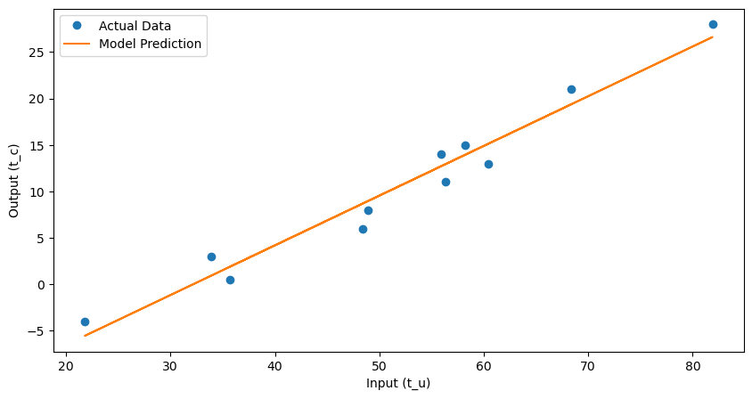
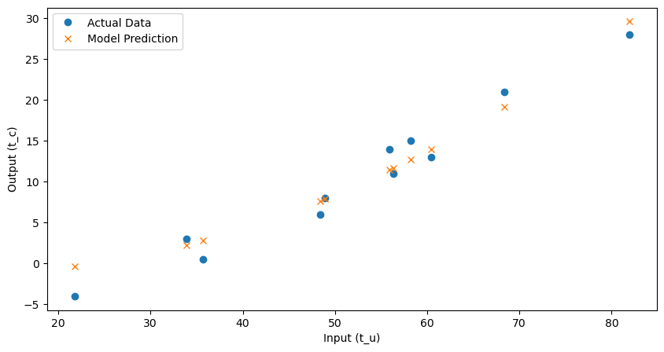

### 파이토치 에피소드 관련 안내

파이토치의 에피소드들은 제가 공부용으로 작성한 ipynb 노트북 파일을 마크다운으로 변환하여 그대로 넣은 것입니다. 이에 따라 설명이 부실하거나 어색할 수 있습니다. 그냥 저의 학습 일지라고 생각해 주시면 좋을 것 같습니다. 나중에 시간이 날 때 설명을 넣는 등 보완해 나가겠습니다.

파이토치 에피소드들은 모두 엘리 스티븐스 외 2인의 책 **파이토치 딥러닝 마스터**의 내용을 바탕으로 하였음을 밝힙니다. 본 에피소드는 책의 **5장. 학습 기법**을 공부한 내용입니다.
___

**차례**

- [학습은 파라미터 추정에 불과](#학습은-파라미터-추정에-불과)
  - [온도 문제](#온도-문제)
- [경사 하강](#경사-하강)
  - [미분 적용](#미분-적용)
- [모델 적합을 위한 반복](#모델-적합을-위한-반복)
  - [입력 정규화](#입력-정규화)
- [자동 미분](#자동-미분)
  - [골라쓰는 옵티마이저](#골라쓰는-옵티마이저)
  - [훈련, 검증, 과적합](#훈련-검증-과적합)
- [연습문제](#연습문제)
- [결론](#결론)

___

이 장에서는 일반 함수의 적합(fitting)을 자동화하는 방법을 배운다. 이것이 딥러닝의 핵심이다!

심층 신경망이 우리가 말하는 일반 함수이며, 파이토치는 이 과정을 최대한 단순하고 투명하게 만들어준다. 

하지만 먼저 심층 신경망보다 훨씬 단순한 모델로 시작해보자.

## 학습은 파라미터 추정에 불과

### 온도 문제


```python
import torch
import numpy as np
```


```python
t_c = [0.5, 14.0, 15.0, 28.0, 11.0, 8.0, 3.0, -4.0, 6.0, 13.0, 21.0]
t_u = [35.7, 55.9, 58.2, 81.9, 56.3, 48.9, 33.9, 21.8, 48.4, 60.4, 68.4]
t_c = torch.tensor(t_c)
t_u = torch.tensor(t_u)
```

선형 모델로 추정하고 `t_c = w*t_u + b` 라고 추정하면, 이것이 우리의 모델이 된다. w, b는 모델의 파라미터이다. 이렇게 모델로 표현된 t_u의 값을 실제 값과 최대한 가깝도록 맞춰가는 과정이 훈련이다. 신경망 훈련은 이것보다는 조금 더 복잡할 뿐.

그렇다면 그 '최대한 가깝도록' 하는 것을 어떻게 해야 할까? 그것은 '손실 함수'라는 측정 함수를 만들고 이를 최소화함으로써 할 수 있는데, 이 손실 함수는 이름에서 알 수 있다시피 오차가 높을수록 커지도록 설계된 함수이다. 이렇게 손실 함수의 값이 최소인 지점에서 w와 b를 찾는 과정을 최적화 과정이라 한다.

손실 함수는 차이를 제곱한 손실 함수를 사용할 것이다: `(t_p - t_c)^2` (여기서 t_p는 모델로 추정한 값)


```python
def model(t_u: torch.Tensor, w, b):
    return w*t_u+b


def loss_fn(t_p: torch.Tensor, t_c: torch.Tensor):
    squared_diffs = (t_p-t_c)**2
    return squared_diffs.mean()  # 평균 제곱 손실
```

이제 파라미터를 초기화하고 모델을 호출할 수 있다.


```python
w = torch.ones(())
b = torch.zeros(())

t_p = model(t_u, w, b)
t_p
```


    tensor([35.7000, 55.9000, 58.2000, 81.9000, 56.3000, 48.9000, 33.9000, 21.8000,
            48.4000, 60.4000, 68.4000])


```python
loss = loss_fn(t_p, t_c)
loss
```


    tensor(1763.8848)


## 경사 하강


```python
delta = 0.1

loss_rate_of_change_w = \
    (loss_fn(model(t_u, w+delta, b), t_c) -
     loss_fn(model(t_u, w-delta, b), t_c)) / (2.0*delta)
```


```python
learning_rate = 1e-2

w = w - learning_rate * loss_rate_of_change_w
```

b에 대해서도 동일하게...


```python
loss_rate_of_change_b = \
    (loss_fn(model(t_u, w, b+delta), t_c) -
     loss_fn(model(t_u, w, -delta), t_c)) // (2.0*delta)

b = b - learning_rate * loss_rate_of_change_b
```

이런 식의 평가 (충분히 작은 학습률을 고른 상태에서...)를 반복함으로써 주어진 데이터에 대해 손실 계산값이 최소로 떨어지는 최적의 파라미터 값으로 수렴하게 된다.

지금은 변화율이 너무 심해서 조정할 필요가 있다.

### 미분 적용


```python
def dloss_fn(t_p, t_c):
    dsq_diffs = 2 * (t_p - t_c) / t_p.size(0)
    return dsq_diffs
```


```python
def dmodel_dw(t_u, w, b):
    return t_u


def dmodel_db(t_u, w, b):
    return 1.0


def grad_fn(t_u, t_c, t_p, w, b):
    dloss_dtp = dloss_fn(t_p, t_c)
    dloss_dw = dloss_dtp * dmodel_dw(t_u, w, b)
    dloss_db = dloss_dtp * dmodel_db(t_u, w, b)

    return torch.stack([dloss_dw.sum(), dloss_db.sum()])
```

## 모델 적합을 위한 반복


```python
def training_loop(n_epochs, learning_rate, params, t_u, t_c):
    for epoch in range(1, n_epochs+1):
        w, b = params
        t_p = model(t_u, w, b)
        loss = loss_fn(t_p, t_c)
        grad = grad_fn(t_u, t_c, t_p, w, b)
        params = params - learning_rate * grad
        print('Epoch %d, Loss %f' % (epoch, float(loss)))
        print(f'Params: {params}')
        print(f'Grad: {grad}')
        print()

    return params
```


```python
training_loop(
    n_epochs=100,
    learning_rate=1e-2,
    params=torch.tensor([1.0, 0.0]),
    t_u=t_u,
    t_c=t_c
)
```

    Epoch 1, Loss 1763.884766
    Params: tensor([-44.1730,  -0.8260])
    Grad: tensor([4517.2964,   82.6000])
    
    Epoch 2, Loss 5802484.500000
    Params: tensor([2568.4011,   45.1637])
    Grad: tensor([-261257.4062,   -4598.9702])
    
    Epoch 3, Loss 19408029696.000000
    Params: tensor([-148527.7344,   -2616.3931])
    Grad: tensor([15109614.0000,   266155.6875])
    
    Epoch 4, Loss 64915905708032.000000
    Params: tensor([8589999.0000,  151310.8906])
    Grad: tensor([-8.7385e+08, -1.5393e+07])
    
    Epoch 5, Loss 217130525461053440.000000
    Params: tensor([-4.9680e+08, -8.7510e+06])
    Grad: tensor([5.0539e+10, 8.9023e+08])
    
    Epoch 6, Loss 726257583152928129024.000000
    Params: tensor([2.8732e+10, 5.0610e+08])
    Grad: tensor([-2.9229e+12, -5.1486e+10])
    
    Epoch 7, Loss 2429183416467662896627712.000000
    Params: tensor([-1.6617e+12, -2.9270e+10])
    Grad: tensor([1.6904e+14, 2.9776e+12])
    
    (중간 생략)
    
    Epoch 97, Loss nan
    Params: tensor([nan, nan])
    Grad: tensor([nan, nan])
    
    Epoch 98, Loss nan
    Params: tensor([nan, nan])
    Grad: tensor([nan, nan])
    
    Epoch 99, Loss nan
    Params: tensor([nan, nan])
    Grad: tensor([nan, nan])
    
    Epoch 100, Loss nan
    Params: tensor([nan, nan])
    Grad: tensor([nan, nan])
    
    


    tensor([nan, nan])


뭔가 잘못됐다! 아마 learning_rate가 너무 큰 것 같다.


```python
training_loop(
    n_epochs=100,
    learning_rate=1e-4,
    params=torch.tensor([1.0, 0.0]),
    t_u=t_u,
    t_c=t_c
)
```

    Epoch 1, Loss 1763.884766
    Params: tensor([ 0.5483, -0.0083])
    Grad: tensor([4517.2964,   82.6000])
    
    Epoch 2, Loss 323.090515
    Params: tensor([ 0.3623, -0.0118])
    Grad: tensor([1859.5493,   35.7843])
    
    Epoch 3, Loss 78.929634
    Params: tensor([ 0.2858, -0.0135])
    Grad: tensor([765.4666,  16.5122])
    
    Epoch 4, Loss 37.552845
    Params: tensor([ 0.2543, -0.0143])
    Grad: tensor([315.0790,   8.5787])
    
    (중간 생략)
    
    Epoch 99, Loss 29.023582
    Params: tensor([ 0.2327, -0.0435])
    Grad: tensor([-0.0533,  3.0226])
    
    Epoch 100, Loss 29.022667
    Params: tensor([ 0.2327, -0.0438])
    Grad: tensor([-0.0532,  3.0226])
    
    


    tensor([ 0.2327, -0.0438])


다른 문제가 생긴 것 같다. 손실이 너무 느리게 줄어들다가 결국 멈춰버린다는 것. learning_rate를 적응형으로 만들면 방지할 수 있다.

그와 다른 문제도 발견할 수 있는데, Epoch 1의 Grad를 보면 그렇다.

### 입력 정규화

문제는 w의 grad가 b의 grad보다 훨씬 크다는 데서 발생한다. 이는 입력값을 정규화함으로써 해결할 수 있다.


```python
t_un = 0.1 * t_u
```


```python
w, b = training_loop(
    n_epochs=3000,
    learning_rate=1e-2,
    params=torch.tensor([1.0, 0.0]),
    t_u=t_un,
    t_c=t_c
)
w, b
```

    Epoch 1, Loss 80.364342
    Params: tensor([1.7761, 0.1064])
    Grad: tensor([-77.6140, -10.6400])
    
    Epoch 2, Loss 37.574913
    Params: tensor([2.0848, 0.1303])
    Grad: tensor([-30.8623,  -2.3864])
    
    Epoch 3, Loss 30.871077
    Params: tensor([2.2094, 0.1217])
    Grad: tensor([-12.4631,   0.8587])
    
    Epoch 4, Loss 29.756193
    Params: tensor([2.2616, 0.1004])
    Grad: tensor([-5.2218,  2.1327])
    
    Epoch 5, Loss 29.507153
    Params: tensor([2.2853, 0.0740])
    Grad: tensor([-2.3715,  2.6310])
    

    (중간 생략)
    
    Epoch 3000, Loss 2.928648
    Params: tensor([  5.3489, -17.1980])
    Grad: tensor([-0.0032,  0.0182])
    
    


    (tensor(5.3489), tensor(-17.1980))


```python
t_p = model(t_u, 0.1*w, b)
t_p
```


    tensor([ 1.8974, 12.7021, 13.9323, 26.6091, 12.9161,  8.9579,  0.9346, -5.5375,
             8.6905, 15.1091, 19.3882])


```python
import matplotlib.pyplot as plt

# 모델 예측값
t_p = model(t_un, w, b)

# 그래프 그리기
plt.figure(figsize=(10, 5))
plt.plot(t_u.numpy(), t_c.numpy(), 'o', label='Actual Data')
plt.plot(t_u.numpy(), t_p.detach().numpy(), label='Model Prediction')
plt.xlabel('Input (t_u)')
plt.ylabel('Output (t_c)')
plt.legend()
plt.show()
```


    

    


## 자동 미분

일일이 복잡한 함수의 미분에 대한 해석 가능한 표현식을 작성하는 작업은 즐겁지 않다. 이러한 이유로 파이토치 자동미분 기능과 파이토치 텐서가 구세주처럼 등장한다.

파이토치 텐서는 놀랍게도 자신이 어디로부터 왔는지 기억하고 있어, 미분을 최초 입력까지 자연스럽게 연쇄적으로 적용해 올라갈 수 있다. 이를 통해 순방향 식만 주어지면 파이토치는 아무리 복잡하더라도 입력 파라미터와 관련해 표현식에 대한 기울기를 자동으로 제공해 준다.


```python
params = torch.tensor([1.0, 0.0], requires_grad=True)
```


```python
params.grad is None
```


    True


```python
loss = loss_fn(model(t_u, *params), t_c)
loss.backward()
```


```python
params.grad
```


    tensor([4517.2969,   82.6000])


backward 호출은 미분을 말단 노드에 누적한다. 저장이 아니다. 따라서 앞서 backward가 호출되었다면 손실이 다시 계산되고 backward가 다시 호출되고 말단 노드의 기울기 값이 기존값에 '누적'되어 부정확한 기울기값을 초래한다.

이를 방지하려면 각 반복문에서 명시적으로 기울기를 0으로 초기화해야 한다. zero_ 메소드를 사용해 쉽게 초기화할 수 있다.


```python
def training_loop_new(n_epochs, learning_rate, params, t_u, t_c):
    for epoch in range(1, n_epochs+1):
        if params.grad is not None:
            params.grad.zero_()
        t_p = model(t_u, *params)
        loss = loss_fn(t_p, t_c)
        loss.backward()

        with torch.no_grad():
            params -= learning_rate * params.grad

        if epoch % 500 == 0:
            print('Epoch %d, Loss %f' % (epoch, float(loss)))
    return params
```


```python
t_un = t_u*0.1
training_loop_new(n_epochs=5000, learning_rate=1e-2,
                  params=torch.tensor([1.0, 0.0], requires_grad=True), t_u=t_un, t_c=t_c)
```

    Epoch 500, Loss 7.860115
    Epoch 1000, Loss 3.828538
    Epoch 1500, Loss 3.092191
    Epoch 2000, Loss 2.957698
    Epoch 2500, Loss 2.933134
    Epoch 3000, Loss 2.928648
    Epoch 3500, Loss 2.927830
    Epoch 4000, Loss 2.927679
    Epoch 4500, Loss 2.927652
    Epoch 5000, Loss 2.927647
    


    tensor([  5.3671, -17.3012], requires_grad=True)


### 골라쓰는 옵티마이저


```python
import torch.optim as optim

dir(optim)
```


    ['ASGD',
     'Adadelta',
     'Adafactor',
     'Adagrad',
     'Adam',
     'AdamW',
     'Adamax',
     'LBFGS',
     'NAdam',
     'Optimizer',
     'RAdam',
     'RMSprop',
     'Rprop',
     'SGD',
     'SparseAdam',
     '__all__',
     '__builtins__',
     '__cached__',
     '__doc__',
     '__file__',
     '__loader__',
     '__name__',
     '__package__',
     '__path__',
     '__spec__',
     '_adafactor',
     '_functional',
     'lr_scheduler',
     'swa_utils']


```python
params = torch.tensor([1.0, 0.0], requires_grad=True)
learning_rate = 1e-1
optimizer = optim.Adam([params], lr=learning_rate)
```


```python
t_p = model(t_u, *params)
loss = loss_fn(t_p, t_c)
loss.backward()

optimizer.step()

params
```


    tensor([ 0.9900, -0.0100], requires_grad=True)


```python
def training_loop_opt(n_epochs, optimizer, params, t_u, t_c):
    for epoch in range(1, n_epochs+1):
        t_p = model(t_u, *params)
        loss = loss_fn(t_p, t_c)
        optimizer.zero_grad()
        loss.backward()

        optimizer.step()

        if epoch % 500 == 0:
            print('Epoch %d, Loss %f' % (epoch, float(loss)))

    return params
```


```python

training_loop_opt(n_epochs=5000, optimizer=optimizer,
                  params=params, t_u=t_u, t_c=t_c)
```

    Epoch 500, Loss 4.040475
    Epoch 1000, Loss 4.002699
    Epoch 1500, Loss 3.964714
    Epoch 2000, Loss 3.917868
    Epoch 2500, Loss 3.860785
    Epoch 3000, Loss 3.792269
    Epoch 3500, Loss 3.711602
    Epoch 4000, Loss 3.618947
    Epoch 4500, Loss 3.515834
    Epoch 5000, Loss 3.405663
    


    tensor([  0.5780, -19.6404], requires_grad=True)


### 훈련, 검증, 과적합


```python
n_samples = t_u.shape[0]
n_val = int(0.2 * n_samples)

shuffled_indices = torch.randperm(n_samples)

train_indices = shuffled_indices[:-n_val]
val_indices = shuffled_indices[-n_val:]

train_indices, val_indices
```


    (tensor([5, 8, 9, 4, 2, 7, 6, 3, 0]), tensor([ 1, 10]))


```python
train_t_u = t_u[train_indices]
train_t_c = t_c[train_indices]
val_t_u = t_u[val_indices]
val_t_c = t_c[val_indices]

train_t_un = train_t_u * 0.1
val_t_un = val_t_u * 0.1
```


```python
def training_loop_tr(n_epochs, optimizer, params, val_t_u, val_t_c, train_t_u, train_t_c):
    for epoch in range(1, n_epochs+1):
        train_t_p = model(train_t_u, *params)
        val_t_p = model(val_t_u, *params)

        train_loss = loss_fn(train_t_p, train_t_c)
        val_loss = loss_fn(val_t_p, val_t_c)
        optimizer.zero_grad()
        train_loss.backward()

        optimizer.step()

        if epoch <= 3 or epoch % 500 == 0:
            print(f"Epoch {epoch}, Training loss {train_loss.item():.4f},"
                  f" Validation loss {val_loss.item():.4f}")

    return params
```


```python
params = torch.tensor([1.0, 0.0], requires_grad=True)
learning_rate = 1e-2
optimizer = optim.SGD([params], lr=learning_rate)

training_loop_tr(n_epochs=5000, optimizer=optimizer, params=params, val_t_c=val_t_c, val_t_u=val_t_un, train_t_c=train_t_c, train_t_u=train_t_un)
```

    Epoch 1, Training loss 68.0860, Validation loss 135.6169
    Epoch 2, Training loss 39.1856, Validation loss 59.3976
    Epoch 3, Training loss 33.5852, Validation loss 36.1620
    Epoch 500, Training loss 7.0901, Validation loss 8.8026
    Epoch 1000, Training loss 3.5208, Validation loss 5.4415
    Epoch 1500, Training loss 3.0223, Validation loss 4.4355
    Epoch 2000, Training loss 2.9526, Validation loss 4.0944
    Epoch 2500, Training loss 2.9429, Validation loss 3.9718
    Epoch 3000, Training loss 2.9415, Validation loss 3.9267
    Epoch 3500, Training loss 2.9414, Validation loss 3.9099
    Epoch 4000, Training loss 2.9413, Validation loss 3.9036
    Epoch 4500, Training loss 2.9413, Validation loss 3.9013
    Epoch 5000, Training loss 2.9413, Validation loss 3.9005
    


    tensor([  5.2137, -16.8632], requires_grad=True)


torch.no_grad()와 torch.set_grad_enabled() 콘텍스트 관리자에 대한 내용은 책을 참고하자.

## 연습문제

모델을 `w2 * t_u ** 2 + w1 * t_u + b`로 다시 정의하자.

그러면 이제 파라미터가 세 개가 되었다. 


```python
params = torch.tensor([0.1, 1.0, 0.0], requires_grad=True)
learning_rate = 1e-4
optimizer = optim.SGD([params], lr=learning_rate)

def new_model(t_u, w1, w2, b):
    return w2 * t_u ** 2 + w1 * t_u + b

def training_loop_another(n_epochs, optimizer, params, t_u, t_c):
    for epoch in range(1, n_epochs+1):
        t_p = new_model(t_u, *params)
        loss = loss_fn(t_p, t_c)
        
        optimizer.zero_grad()
        loss.backward()
        optimizer.step()
        
        if epoch<=3 or epoch%500 == 0:
            print(f"Epoch {epoch}, Loss {loss.item():.4f}")
    return params
t_un = t_u * 0.1            
training_loop_another(n_epochs=5000, optimizer=optimizer, params=params, t_u=t_un, t_c=t_c)
        
        
```

    Epoch 1, Loss 447.9037
    Epoch 2, Loss 265.7491
    Epoch 3, Loss 159.0233
    Epoch 500, Loss 6.7666
    Epoch 1000, Loss 5.8650
    Epoch 1500, Loss 5.2224
    Epoch 2000, Loss 4.7641
    Epoch 2500, Loss 4.4369
    Epoch 3000, Loss 4.2030
    Epoch 3500, Loss 4.0354
    Epoch 4000, Loss 3.9150
    Epoch 4500, Loss 3.8282
    Epoch 5000, Loss 3.7652
    


    tensor([-1.1445,  0.5907, -0.6289], requires_grad=True)


```python
import matplotlib.pyplot as plt

# 모델 예측값
t_p = new_model(t_un, *params)

# 그래프 그리기
plt.figure(figsize=(10, 5))
plt.plot(t_u.numpy(), t_c.numpy(), 'o', label='Actual Data')
plt.plot(t_u.numpy(), t_p.detach().numpy(), 'x', label='Model Prediction')
plt.xlabel('Input (t_u)')
plt.ylabel('Output (t_c)')
plt.legend()
plt.show()
```


    

    


## 결론

이번 에피소드에서는 파이토치의 학습 기법에 대해서 연습해 보았다.

[다음 에피소드로](/python/pytorch2)
